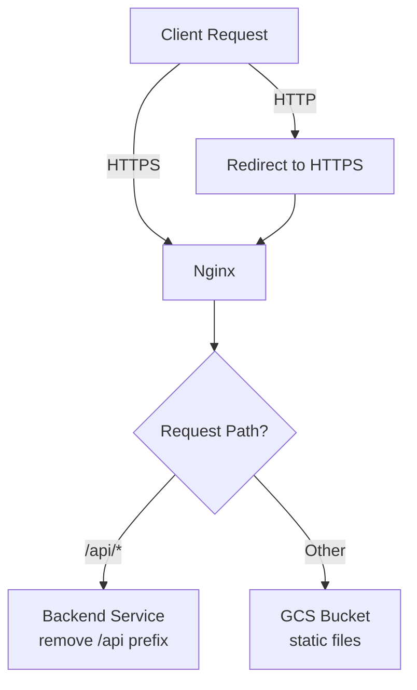

# Gateway

Gateway is a service running [nginx] and [gcsfuse] to serve static files and proxy /api requests to the backend.

## Configuration

Environment variables:

* HOSTNAME - hostname nginx rules will listen on
* HTTP_PORT - http port nginx will listen on (defaults to 80)
* HTTPS_PORT - https port nginx will listen on (defaults to 443)
* CERTS_PATH - path to find certificates and keys (defaults to /etc/certs.d)
* BACKEND_URL - backend url to proxy /api requests
* GCS_BUCKET - bucket to read static files from

## Behavior

By default, gateway will on startup:

* Configure nginx to listen on all hostnames, if HOSTNAME
  is configured it will only listen on that hostnames, and serve the 404 page for all others
* If valid certs file are found in CERTS_PATH, nginx will terminate the https
  connection and redirect all http requests to https
* If BACKEND_URL is configured, will redirect all requets starting with /api to it,
  removing the `/api` from the original request
* For all other requests, serve files from the bucket configured at GCS_BUCKET

### Traffic Flow



## Testing

The gateway includes an automated test suite that verifies all core functionality.

### Test Coverage

The test suite validates:

* HTTP to HTTPS redirect behavior
* API request proxying to backend with `/api` prefix removal
* POST request proxying
* Static file serving
* Custom 404 page handling
* Proxy header forwarding (X-Forwarded-For, X-Real-IP, X-Forwarded-Proto)

### Running Tests

**Prerequisites:**
* Docker and docker-compose installed
* All test files present in the gateway directory

**Run the full test suite:**

```bash
docker-compose up --build
```

This will:
1. Build the gateway and test containers
2. Start a mock backend service
3. Start the gateway service
4. Execute the test suite
5. Display test results with color-coded output

**Run tests in detached mode:**

```bash
docker-compose up -d --build
sleep 10
docker logs gateway-test
```

**Clean up after testing:**

```bash
docker-compose down
```

### Test Architecture

The test environment consists of:

* **gateway** - The gateway service under test
* **mock-backend** - A Python HTTP server that simulates the backend API
* **gateway-test** - Python test container that executes integration tests

Tests are written in Python using the `requests` library and verify gateway behavior by making HTTP/HTTPS requests and validating responses.

[gcsfuse]: https://github.com/GoogleCloudPlatform/gcsfuse
[nginx]: https://nginx.org/
